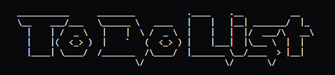
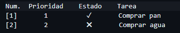
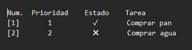

# To-Do List de Consola

Aplicacion de consola escrita en C++ para gestionar una lista de tareas con prioridades. Permite añadir tareas, marcarlas como hechas, ordenarlas por prioridad y exportarlas a un archivo `.txt`.

<p align="center">
  
</p>

## Requisitos

- Compilador C++ con soporte para C++11 o superior (`g++`)
- `make`

## Compilar y ejecutar

```bash
make          # Compila el codigo y genera program.exe
./program.exe # Ejecuta la aplicacion
```

```bash
make clean    # Borra el ejecutable y los archivos .txt generados
```

## Uso

Al iniciar el programa se muestra el menu de opciones:

```
////////////////////////////////////////////////////////////////////
Bienvenido a la aplicacion (basica) para hacer tu To-Do List!
Se dara la opcion para poder escoger entre tres prioridades, siendo
1 la maxima prioridad y 3 la minima
Tambien podras marcar como hecho las tareas ya realizadas
A parte, podras exportarlo a un .txt
////////////////////////////////////////////////////////////////////

Selecciona una de las posibles opciones:
00. Salir
01. Añadir tarea a la lista
02. Marcar tarea como hecha
03. Ordenar la lista
04. Mostrar la lista
05. Borrar las tareas hechas y ordena
06. Borrar la lista
07. Exportar lista tipo .txt
08. Mostrar opciones
```

<p align="center">
  
</p>

### Opciones

| Opcion | Descripcion |
|--------|-------------|
| `00`   | Salir del programa |
| `01`   | Añade una nueva tarea con nombre y prioridad (1, 2 o 3) |
| `02`   | Marca una tarea existente como completada |
| `03`   | Ordena las tareas por prioridad (y alfabeticamente en caso de empate) |
| `04`   | Muestra la lista completa con estado y prioridad de cada tarea |
| `05`   | Elimina las tareas completadas y reordena la lista |
| `06`   | Borra toda la lista (pide confirmacion) |
| `07`   | Exporta la lista actual a un archivo `.txt` dentro de la carpeta `out/` |
| `08`   | Vuelve a mostrar el menu de opciones |

## Exportar la lista

La opcion `07` genera un archivo `.txt` en la carpeta `out/`. Si ya existe un archivo con el mismo nombre, se añade un sufijo numerico automaticamente (`nombre(1).txt`, `nombre(2).txt`, etc.).

<p align="center">
  
</p>

## Estructura del proyecto

```
.
├── main.cc               # Punto de entrada y bucle principal
├── include/
│   ├── funciones.hh      # Logica de gestion de tareas
│   └── menu.hh           # Funciones de visualizacion del menu
├── out/                  # Carpeta donde se guardan los .txt exportados
└── Makefile
```
